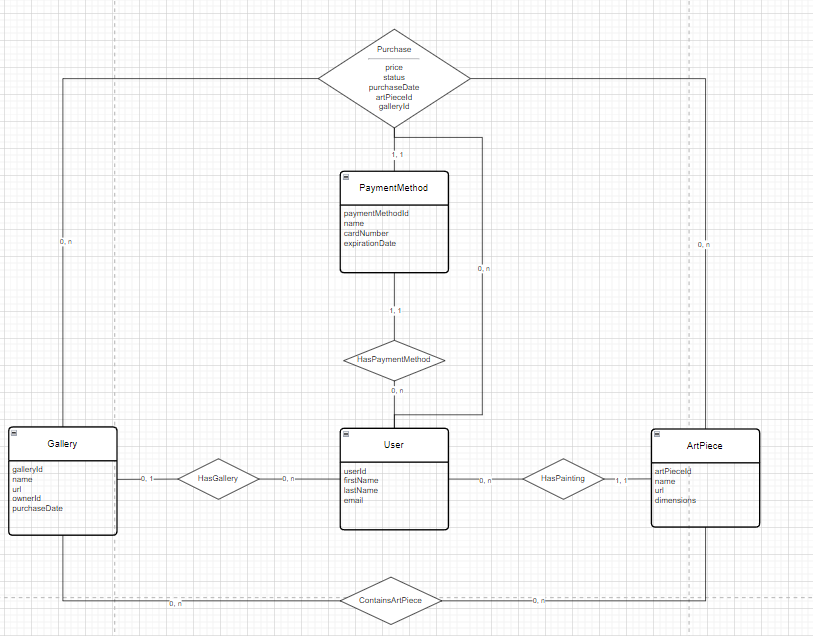
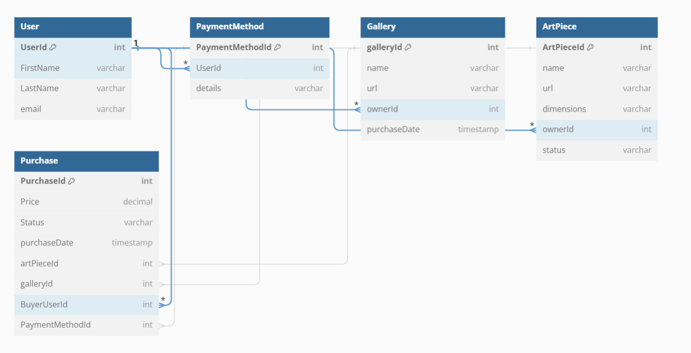

# Project README

## Database Schema

### Tables

#### User
- **UserId** (int, PK): The unique identifier for a user.
- **FirstName** (varchar): The first name of the user.
- **LastName** (varchar): The last name of the user.
- **email** (varchar): The email address of the user.

#### PaymentMethod
- **PaymentMethodId** (int, PK): The unique identifier for a payment method.
- **UserId** (int, FK -> User.UserId): The user associated with the payment method.
- **details** (varchar): Details of the payment method.

#### Gallery
- **galleryId** (int, PK): The unique identifier for a gallery.
- **name** (varchar): The name of the gallery.
- **url** (varchar): The URL of the gallery.
- **ownerId** (int, FK -> User.UserId): The owner of the gallery.
- **purchaseDate** (timestamp): The date the gallery was purchased.

#### ArtPiece
- **ArtPieceId** (int, PK): The unique identifier for an art piece.
- **name** (varchar): The name of the art piece.
- **url** (varchar): The URL of the art piece.
- **dimensions** (varchar): The dimensions of the art piece.
- **ownerId** (int, FK -> User.UserId): The owner of the art piece.
- **status** (varchar): The status of the art piece.

#### Purchase
- **PurchaseId** (int, PK): The unique identifier for a purchase.
- **Price** (decimal): The price of the purchase.
- **Status** (varchar): The status of the purchase.
- **purchaseDate** (timestamp): The date of the purchase.
- **artPieceId** (int, FK -> ArtPiece.ArtPieceId): The art piece involved in the purchase.
- **galleryId** (int, FK -> Gallery.galleryId): The gallery involved in the purchase.
- **BuyerUserId** (int, FK -> User.UserId): The buyer involved in the purchase.
- **PaymentMethodId** (int, FK -> PaymentMethod.PaymentMethodId): The payment method used in the purchase.

### Relationships

- **User** to **PaymentMethod**: One to Many (A user can have multiple payment methods)
- **User** to **Gallery**: One to Many (A user can own multiple galleries)
- **User** to **ArtPiece**: One to Many (A user can own multiple art pieces)
- **Gallery** to **ArtPiece**: Many to Many (A gallery can contain multiple art pieces and an art piece can be in multiple galleries)
- **Purchase** involves multiple entities:
    - **User** (as a buyer)
    - **ArtPiece**
    - **Gallery**
    - **PaymentMethod**

### Diagram





If you wish to modify the above schema, you can do so by copying the below schema representation to dbdiagram.io

### DBDiagram.io Schema

```sql
Table User {
  UserId int [pk]
  FirstName varchar
  LastName varchar
  email varchar
}

Table PaymentMethod {
  PaymentMethodId int [pk]
  UserId int [ref: > User.UserId]
  details varchar
}

Table Gallery {
  galleryId int [pk]
  name varchar
  url varchar
  ownerId int [ref: > User.UserId]
  purchaseDate timestamp
}

Table ArtPiece {
  ArtPieceId int [pk]
  name varchar
  url varchar
  dimensions varchar
  ownerId int [ref: > User.UserId]
  status varchar
}

Table Purchase {
  PurchaseId int [pk]
  Price decimal
  Status varchar
  purchaseDate timestamp
  artPieceId int [ref: > ArtPiece.ArtPieceId]
  galleryId int [ref: > Gallery.galleryId]
  BuyerUserId int [ref: > User.UserId]
  PaymentMethodId int [ref: > PaymentMethod.PaymentMethodId]
}
```
